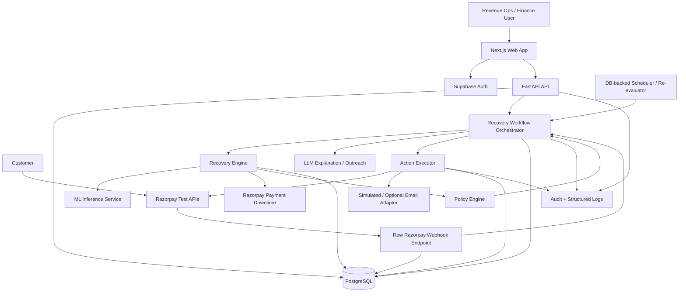

# RecoverIQ — Architecture

**Status:** Phase 0 architecture baseline  
**Authority:** RecoverIQ PRD/SRS  
**Change policy:** Architectural decisions marked **LOCKED** should not be changed casually. Any change must update this file, `DOMAIN_MODEL.md`, `STATE_MACHINE.md`, and affected API/database contracts in the same commit.

## 1. System purpose

RecoverIQ is an AI-assisted revenue recovery control plane for Razorpay merchants. The P0 system detects failed one-time and subscription payments, creates a `RecoveryCase`, evaluates candidate recovery actions, predicts action-specific recovery probability, ranks actions by Expected Recovery Value (ERV), applies deterministic safety policy, executes an allowed action, observes the provider outcome, and records verified recovered revenue.

The system is intentionally not a generic chatbot, CRM, marketing platform, fraud system, or multi-agent framework.

## 2. Architectural principles

1. **Financial execution is deterministic.** ML may score; LLMs may explain/generate bounded text; neither can bypass policy or directly mutate money state.
2. **Persist before side effect.** Intent/state for an external action must be durably recorded before the external call is attempted.
3. **Every external action is idempotent at RecoverIQ level.** Local uniqueness prevents duplicate action creation even if provider/webhook delivery repeats.
4. **Provider events are evidence, not ordered commands.** Webhooks may be duplicated or arrive out of order.
5. **Successful payment evidence dominates recovery state.** Once revenue is verified recovered, later stale failure events cannot reopen the case.
6. **Money is integer minor units.** Never use floating point for amounts.
7. **PostgreSQL owns workflow state.** No in-memory agent memory is authoritative.
8. **The core recovery engine runs without an LLM.** LLM failure must not prevent detection, scoring, policy, execution eligibility, or outcome recording.
9. **One backend service for the hackathon.** Do not split into microservices until the P0 workflow is complete.
10. **Typed contracts at every boundary.** Pydantic on the backend; generated TypeScript contracts on the frontend.

## 3. Technology baseline

| Layer | Technology | Responsibility |
|---|---|---|
| Web UI | Next.js + React + TypeScript | B2B SaaS dashboard and recovery workflows |
| UI system | Tailwind + shadcn/ui + Recharts + TanStack Table | Consistent layout, tables, charts |
| API | FastAPI + Pydantic | Authenticated JSON API, webhook endpoint, validation |
| Persistence | PostgreSQL (Supabase hosted) | Domain state, event log, audit, analytics source |
| ORM/migrations | SQLAlchemy 2 + Alembic | Persistence mapping and schema evolution |
| Auth | Supabase Auth | User identity; backend validates JWT |
| Recovery engine | Plain Python domain services | Classification, feature construction, action ranking, policy |
| ML | scikit-learn baseline; XGBoost candidate | Action-specific recovery propensity |
| LLM | Provider abstraction, Gemini default | Structured explanation and bounded outreach copy |
| Payments | Razorpay Test Mode | Payment events, subscriptions, downtime, selected Payment Links |
| Deployment | Vercel + Render + Supabase | Hackathon-friendly hosting |
| Observability | Structured logs + audit tables; optional Sentry | Failures, latency, action traceability |

## 4. Component responsibilities

### 4.1 `apps/web` — Frontend

Owns:
- authentication UX;
- executive dashboard;
- recovery opportunities table;
- recovery case detail;
- audit/agent timeline;
- approval/execute interactions;
- loading, error, empty states.

Must not own:
- ERV calculations;
- policy decisions;
- recovery probability;
- payment credentials;
- webhook validation;
- source-of-truth workflow state.

The frontend renders backend-computed financial values. It may format amounts but must not recompute business-critical totals independently.

### 4.2 `apps/api/app/api` — HTTP layer

Owns:
- route registration;
- authentication and authorization dependencies;
- request/response schema validation;
- status/error mapping;
- correlation/request IDs.

Must not contain substantial recovery business logic. Routes call application/domain services.

### 4.3 `apps/api/app/recovery` — Recovery domain engine

Owns:
- failure normalization;
- feature construction;
- candidate action generation;
- deterministic baselines;
- ERV;
- ranking;
- confidence aggregation;
- stopping-rule evaluation.

It may call the ML inference interface but cannot call Razorpay directly.

### 4.4 `apps/api/app/workflows` — Workflow/state orchestration

Owns:
- legal `RecoveryCase` state transitions;
- scheduling/re-evaluation intents;
- coordinating analysis, policy, approval and execution;
- ensuring persistence around external actions;
- terminal-state protection.

The workflow layer is the only application layer allowed to transition `RecoveryCase.status`.

### 4.5 `apps/api/app/policies` — Safety policy

Owns deterministic constraints such as:
- automatic amount ceiling;
- minimum confidence;
- contact cap;
- maximum recovery attempts;
- cooldown;
- allowed action types;
- approval requirements;
- payment-downtime retry block.

Policy decisions must return machine-readable reasons.

### 4.6 `apps/api/app/ml` — ML runtime

Owns:
- loading a versioned serialized model bundle;
- validating feature vectors;
- producing `P(recovery | case, action)`;
- exposing model metadata/version;
- deterministic fallback if model bundle is absent only when explicitly configured for demo/dev.

Must not mutate domain state or call external providers.

### 4.7 `apps/api/app/ai` — LLM services

Owns only:
- structured recommendation explanation from approved evidence;
- structured outreach draft from approved facts.

The LLM must never:
- calculate authoritative money values;
- decide whether an action is allowed;
- choose an unranked arbitrary action;
- invent a payment failure reason;
- invoke payment APIs directly.

### 4.8 `apps/api/app/integrations/razorpay` — Razorpay adapter

Owns:
- API client configuration;
- Payment Link create/fetch/cancel operations used by P0;
- payment-downtime reads;
- provider-entity retrieval required for reconciliation;
- mapping Razorpay errors into internal integration errors;
- timeouts.

Webhook signature validation belongs in `integrations/razorpay/webhooks.py`; event-to-domain handling belongs to workflow/application services.

### 4.9 `apps/api/app/db` and `models`

Own:
- SQLAlchemy session/engine;
- ORM persistence mappings;
- repositories/query helpers where useful;
- no domain decision logic.

### 4.10 Synthetic/demo subsystem

`data/` and `scripts/` own:
- reproducible synthetic training data;
- realistic demo seed data;
- reset scripts;
- batch evaluation fixtures.

Synthetic/test records must be explicitly tagged; never present them as production data.

## 5. Final system architecture



## 6. Primary data flow

### 6.1 Failed payment ingestion

1. Razorpay sends a webhook.
2. FastAPI reads the **raw request body**.
3. Razorpay adapter validates `X-Razorpay-Signature` before parsing.
4. `x-razorpay-event-id` is persisted with a unique constraint.
5. Duplicate event returns a successful idempotent response and does not repeat domain work.
6. Event is normalized into an internal provider event.
7. Relevant transaction/subscription records are upserted.
8. Qualifying failure creates or updates exactly one open `RecoveryCase` for the source failure.
9. Workflow transitions the case to analysis.

### 6.2 Analysis and recommendation

1. Feature builder loads customer, payment, failure, attempt and contact history.
2. Payment-downtime context is fetched only where applicable; a timeout becomes `unknown`, not fabricated `no downtime`.
3. Candidate actions are generated deterministically.
4. ML predicts success probability for each candidate.
5. ERV is computed deterministically.
6. Policy removes blocked actions and annotates approval requirements.
7. Highest-ranked valid action becomes the recommendation.
8. Recommendation and model version are persisted.
9. LLM may generate a structured explanation after the recommendation exists.
10. Case moves to `RECOMMENDED`, then branches based on policy.

### 6.3 Execution

1. Workflow creates `RecoveryAction` with unique idempotency key.
2. Action intent is committed before external call.
3. Executor calls the appropriate adapter.
4. Provider reference/response is persisted.
5. Case enters `WAITING_FOR_OUTCOME` or `SCHEDULED`.
6. A provider success webhook or provider reconciliation query confirms payment.
7. `RecoveryOutcome` is created once.
8. Case transitions to `RECOVERED` and metrics reflect the verified recovered amount.

## 7. Dependency rules

Allowed dependency direction:

```text
api/routes
  -> workflows/application services
      -> recovery + policy + ml interfaces
      -> repositories
      -> integration interfaces

recovery
  -> domain types
  -> ml protocol/interface
  -> pure utilities

policy
  -> domain types

ml
  -> model artifacts + feature schema

ai
  -> Pydantic output schemas + provider SDK

integrations
  -> provider SDK/httpx
  -> integration DTOs

models/db
  -> SQLAlchemy only
```

Prohibited:
- `recovery` importing FastAPI route modules;
- frontend importing backend implementation code;
- ML importing Razorpay client;
- LLM service importing database ORM models directly;
- Razorpay adapter deciding policy;
- UI computing authoritative recovery state transitions;
- ORM hooks silently triggering external actions.

## 8. Architectural decisions — LOCKED

### ADR-001 — Modular monolith

**Decision:** One FastAPI service, one Next.js web app, one PostgreSQL database.

**Why:** Highest reliability and lowest integration overhead for a hackathon. The boundaries remain modular enough to split later.

**Do not change to:** microservices, Kafka, Kubernetes, service mesh.

### ADR-002 — PostgreSQL is workflow source of truth

State, scheduled work and action intents are persisted in PostgreSQL. Redis is not a P0 requirement.

### ADR-003 — Explicit state machine

`RecoveryCase.status` may change only through the workflow transition function defined in `STATE_MACHINE.md`.

### ADR-004 — Direct SDKs over agent frameworks

No LangChain/LangGraph in P0. Use direct provider SDKs plus Pydantic structured output. Revisit only if the deterministic workflow becomes genuinely unmanageable.

### ADR-005 — One orchestrator, not multi-agent

The system may be described as agentic because it observes, chooses bounded tools, acts, verifies and stops; implementation remains one deterministic orchestrator with specialized services.

### ADR-006 — Action-specific propensity

The primary ML contract predicts probability for a **case-action pair**, not just generic case recoverability.

### ADR-007 — LLM is non-authoritative

If the LLM is unavailable, core recovery calculation and execution eligibility continue.

### ADR-008 — Local idempotency is mandatory

RecoverIQ must enforce unique action intent regardless of provider-level idempotency support.

### ADR-009 — Real vs simulated boundaries

Real P0 integrations: Razorpay test webhooks, selected Standard Payment Link creation/fetch, subscription events, payment-downtime reads. Batch recovery outcomes are synthetic/simulated and must be labeled.

### ADR-010 — No floats for money

All stored/API money fields use integer minor currency units. UI converts to display units only.

## 9. Configuration boundaries

Required backend settings:

```text
DATABASE_URL
SUPABASE_JWT_* or equivalent verification settings
RAZORPAY_KEY_ID
RAZORPAY_KEY_SECRET
RAZORPAY_WEBHOOK_SECRET
LLM_PROVIDER
GEMINI_API_KEY          # when Gemini enabled
MODEL_BUNDLE_PATH
APP_ENV
DEMO_MODE
PUBLIC_APP_BASE_URL
```

No secret-prefixed value is exposed through `NEXT_PUBLIC_*`.

## 10. P0 quality gates

Before any P1 feature is started:
- database migrations work from empty database;
- seed data is reproducible;
- recovery state transition unit tests pass;
- duplicate webhook test passes;
- ERV and policy tests pass;
- one case can run end-to-end without LLM;
- one real Razorpay test integration flow works;
- dashboard displays server-derived metrics;
- demo reset is reliable.
