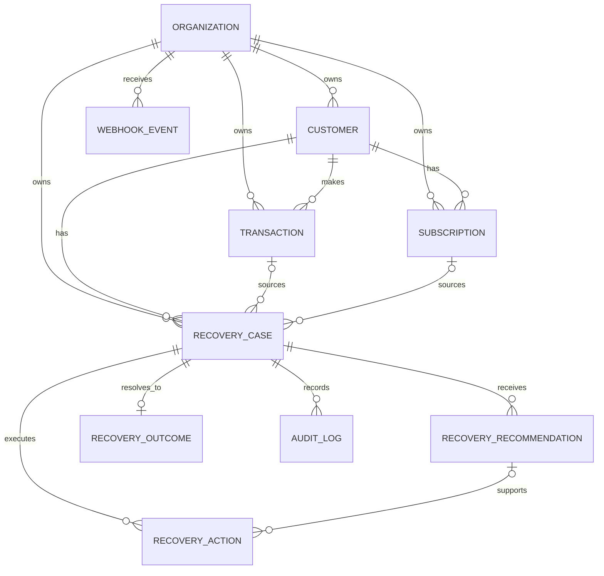

# RevLoop — Domain Model

**Status:** Phase 0 domain contract  
**Rule:** Database models, Pydantic schemas, ML features and UI terminology must use the meanings defined here.

## 1. Ubiquitous language

| Term | Meaning |
|---|---|
| Revenue at Risk | Amount expected by the merchant but currently not successfully collected |
| Recovery Case | Stateful unit of work representing one recoverable revenue-loss event |
| Candidate Action | A recovery intervention eligible for scoring before policy |
| Recommendation | Immutable snapshot of action ranking/model result for a case analysis run |
| Recovery Action | Concrete scheduled/approved/executed intervention |
| Recovery Outcome | Final verified result attributable to a recovery case |
| Recovered Revenue | Successfully collected amount verified from payment evidence, not merely a sent message |
| ERV | Expected Recovery Value of an intervention |
| Failure Category | RevLoop's normalized deterministic category derived from provider evidence |
| Confidence | Trust level in recommendation, separate from recovery probability |
| Policy | Deterministic merchant/safety restrictions applied after scoring |
| Attempt | A domain recovery intervention; distinct from a provider's internal payment retry |
| Technical Retry | Repeating an API request due transient infrastructure error; must not create a new business attempt |
| Provider Retry | Razorpay-managed retry, especially subscription auto-retry |

## 2. Aggregate ownership

The main aggregate is `RecoveryCase`.

`RecoveryCase` owns the lifecycle of:
- recommendations;
- actions;
- outcome;
- case-specific audit entries.

A `Customer`, `Transaction` or `Subscription` is evidence/context but does not own the recovery workflow.

Only the workflow service may mutate `RecoveryCase.status`.

## 3. Organization

Although not the focus of the demo, all tenant-owned records belong to an `Organization`.

### Key properties
- `id`
- `name`
- `currency`
- policy defaults such as automation threshold

### Invariants
- all case data is scoped to exactly one organization;
- relationships may not cross organizations;
- backend authorization derives organization from authenticated user, never from an untrusted request body alone.

## 4. Customer

Represents the merchant's payer/customer.

### Core attributes
- `id`
- `organization_id`
- `external_id`
- display name
- synthetic/demo email/phone when used
- customer segment
- lifetime value in minor units
- first/created timestamp

### Derived features
Not authoritative stored facts unless needed for performance:
- successful payments in lookback window;
- failed payments in lookback window;
- historical payment success rate;
- contacts in last 24h;
- recent recovery success.

### Invariants
- unique `(organization_id, external_id)`;
- monetary attributes use minor units;
- demo records are synthetic and identifiable.

## 5. Transaction

Represents one payment attempt observed from Razorpay or synthetic historical data.

### Core attributes
- internal `id`
- `organization_id`
- `customer_id`
- provider (`razorpay`, `synthetic`)
- `provider_payment_id`
- optional `provider_order_id`
- amount/currency
- payment method
- provider status
- provider failure fields: error code/reason/source/step/description
- occurrence time
- provider event time where available
- metadata JSON

### Invariants
- provider payment ID is unique when present;
- amount >= 0;
- currency is ISO-like 3-letter uppercase code;
- a successful provider state cannot be downgraded by an older failure event;
- raw provider payload is evidence, not the source of business policy.

## 6. Subscription

Represents recurring billing context.

### Core attributes
- internal ID
- organization/customer
- Razorpay subscription ID
- amount in minor units
- provider status
- provider retry/auth attempt count where known
- next/current billing timestamps
- last provider event time

### Important semantics
A Razorpay subscription in `pending` can already be undergoing Razorpay-managed retry behavior. RevLoop must not blindly trigger a competing debit.

### Invariants
- provider subscription ID unique;
- `retry_count >= 0`;
- stale provider events cannot regress a newer known subscription status;
- `subscription.charged`/verified successful payment can resolve the related recovery case.

## 7. RecoveryCase

The central domain entity.

### Purpose
Represents a single revenue-loss opportunity from detection until verified recovery, failure, or stop.

### Identity/source
A case references one primary source:
- `transaction_id` for failed one-time payment; or
- `subscription_id` for recurring failure.

Invoice reference is reserved for P1 and is not required by the P0 API.

### Core attributes
- `id`
- `organization_id`
- `customer_id`
- source reference
- `case_type`
- `amount_at_risk`
- `currency`
- `failure_category`
- `status`
- `priority_score`
- `recovery_probability` (probability of currently recommended action)
- `expected_recoverable_amount`
- `current_recommendation_id` optional
- `opened_at`
- `last_transition_at`
- terminal timestamp `resolved_at`
- `version` optimistic concurrency integer

### Case types
P0:
- `PAYMENT_FAILURE`
- `SUBSCRIPTION_FAILURE`

Reserved P1:
- `OVERDUE_INVOICE`

### Invariants
1. P0 case has exactly one source of its allowed type.
2. `amount_at_risk > 0` for normal recovery cases.
3. terminal cases (`RECOVERED`, `FAILED`, `STOPPED`) cannot be reopened by ordinary events.
4. `RECOVERED` requires verified recovery evidence and a `RecoveryOutcome` with positive recovered amount.
5. exactly one `RecoveryOutcome` per case.
6. current recommendation, if present, must belong to the same case/organization.
7. the case's authoritative status changes only through state-machine code.
8. duplicate provider events must not create duplicate cases for the same failure occurrence.
9. a new later failure after a previously recovered billing cycle may create a **new** case rather than reopening the old case.

## 8. RecoveryRecommendation

Immutable snapshot of one analysis run for one case.

### Purpose
Captures what the system knew and scored at a point in time.

### Fields
- `id`
- case/organization IDs
- `analysis_run_id`
- `action_type`
- `rank`
- `success_probability`
- `expected_value_minor`
- `expected_recovered_minor`
- `confidence`
- `policy_eligibility`
- `requires_approval`
- machine-readable `factors`
- `model_version`
- `feature_schema_version`
- `created_at`

Each analysis run normally stores multiple rows, one for each candidate action. Rank 1 among policy-eligible actions is the selected recommendation.

### Invariants
- probabilities/confidence in [0,1];
- expected values computed by deterministic code, never copied from LLM text;
- recommendation rows are append-only; reanalysis creates a new run;
- model version is mandatory for ML-scored recommendations;
- action ordering is deterministic for equal ERV using a documented tie breaker.

## 9. RecoveryAction

Represents a concrete intervention intent and its execution lifecycle.

### Action types
P0:
- `WAIT`
- `RETRY_SAME_METHOD`
- `REQUEST_ALTERNATE_PAYMENT_METHOD`
- `CREATE_PAYMENT_LINK`
- `SEND_RECOVERY_MESSAGE`
- `ESCALATE_TO_HUMAN`
- `STOP`

Important: `RETRY_SAME_METHOD` is a strategy type. P0 does not invent unsupported direct payment debits. For subscription failures, provider-managed retry may mean this action is represented by waiting/re-evaluation rather than calling an API.

### Action statuses
- `PENDING_APPROVAL`
- `SCHEDULED`
- `EXECUTING`
- `SUCCEEDED`
- `FAILED`
- `UNKNOWN`
- `CANCELLED`

### Core fields
- case/organization IDs
- `recommendation_id`
- action type/status
- `attempt_number`
- `requires_approval`
- approver/timestamps
- `idempotency_key`
- scheduled/executed timestamps
- provider reference
- request fingerprint
- metadata
- error code/category

### Invariants
- idempotency key unique globally;
- an action cannot execute before required approval;
- only one action for a case may be `EXECUTING` at a time;
- action intent must exist before calling external provider;
- a timeout after sending a provider request becomes `UNKNOWN` until reconciled; do not blindly repeat it;
- `STOP` never performs a provider financial call.

## 10. RecoveryOutcome

One final case result.

### Outcome types
- `RECOVERED`
- `NOT_RECOVERED`
- `STOPPED`

### Core fields
- case/organization IDs
- outcome
- recovered amount
- recovered payment/provider ID optional
- verification source (`WEBHOOK`, `PROVIDER_FETCH`, `SIMULATED_BATCH`)
- recovered timestamp
- time to recovery
- metadata

### Invariants
- one outcome per case;
- `RECOVERED` => recovered amount > 0 and verification evidence present;
- `NOT_RECOVERED`/`STOPPED` => recovered amount normally 0;
- synthetic batch outcomes must have `SIMULATED_BATCH` verification source;
- outcome creation and terminal case transition occur atomically in one database transaction.

## 11. WebhookEvent

Durable record of provider event delivery.

### Core fields
- internal ID
- organization ID
- provider
- provider event ID
- event type
- provider created time
- raw payload JSON
- signature validity
- received time
- processing status
- processed time
- processing error

### Processing statuses
- `RECEIVED`
- `PROCESSED`
- `IGNORED`
- `FAILED`

### Invariants
- unique `(provider, provider_event_id)`;
- invalid signature payloads must not be processed as domain events;
- duplicate valid delivery must not duplicate domain mutation;
- raw request body is used for signature verification before JSON parsing;
- event arrival order is not trusted.

## 12. AuditLog

Append-only business trace.

### Examples
- `CASE_CREATED`
- `FAILURE_NORMALIZED`
- `ANALYSIS_COMPLETED`
- `ACTION_BLOCKED_BY_POLICY`
- `APPROVAL_REQUESTED`
- `ACTION_EXECUTION_STARTED`
- `PAYMENT_LINK_CREATED`
- `OUTCOME_VERIFIED`
- `CASE_RECOVERED`
- `STALE_WEBHOOK_IGNORED`

### Fields
- organization
- optional case
- actor type (`SYSTEM`, `USER`, `PROVIDER`, `MODEL`)
- actor ID/version
- event type
- human-readable summary
- structured evidence JSON
- timestamp

### Invariants
- append-only through application services;
- never store secrets, full card data, or unnecessary PII;
- explanation is evidence summary, not model chain-of-thought.

## 13. Relationships

## 14. State ownership

| State/value | Owner |
|---|---|
| `RecoveryCase.status` | Workflow state machine only |
| Failure category | Failure normalizer |
| Feature values | Feature builder |
| Recovery probability | ML inference service |
| ERV | Deterministic recovery engine |
| Policy eligibility | Policy engine |
| Explanation/outreach text | LLM service with fallback |
| Action status | Action executor/workflow |
| Provider payment/subscription status | Integration mapper from verified provider evidence |
| Recovered revenue | Outcome service from verified outcome |
| Dashboard totals | Backend analytics queries |

## 15. Domain-level prohibited behavior

- reopening terminal case from stale webhook;
- marking `RECOVERED` when only a message was sent;
- using LLM text as evidence of payment success;
- storing rupee decimal floats;
- creating a new action because a webhook was retried;
- automatically retrying an `UNKNOWN` provider call without reconciliation;
- mixing synthetic batch money with live/test-mode money without source labels;
- counting Razorpay's internal subscription retry as a new RevLoop action unless RevLoop explicitly initiated/managed an intervention around it.
