# RevLoop — RecoveryCase State Machine

**Status:** Authoritative Phase 0 workflow state contract  
**Critical rule:** No code outside the workflow transition service may directly assign `RecoveryCase.status`.

## 1. States

### `DETECTED`
A qualifying revenue-loss event has been persisted and a case exists, but analysis has not started.

### `ANALYZING`
Features, provider context, candidate actions, ML probabilities and policy eligibility are being calculated.

### `RECOMMENDED`
A complete recommendation snapshot has been persisted. The workflow must immediately choose whether the action requires approval, should be scheduled, can execute, or should stop.

### `AWAITING_APPROVAL`
Selected action requires an authorized human approval before execution.

### `SCHEDULED`
A future action or re-evaluation is durably scheduled.

Examples:
- wait 30 minutes then reanalyze;
- send a bounded message at a scheduled time;
- execute an already-approved action later.

### `EXECUTING`
One `RecoveryAction` intent exists and an external/local side effect is actively being performed.

### `WAITING_FOR_OUTCOME`
An intervention has completed or has uncertain delivery, and the case is awaiting provider/customer outcome evidence or a reconciliation timeout.

### `RECOVERED` — terminal
Revenue has been successfully verified and attributed to the case.

### `FAILED` — terminal
The recovery workflow ended without recovering revenue because available recovery attempts/strategies were exhausted or a terminal unrecoverable condition was established.

### `STOPPED` — terminal
The workflow intentionally stopped without recovery due to policy, negative expected value, customer-contact/attempt limits, operator decision, or explicit STOP recommendation.

## 2. Diagram

```mermaid
stateDiagram-v2
    [*] --> DETECTED: qualifying failure persisted
    DETECTED --> ANALYZING: analysis requested

    ANALYZING --> RECOMMENDED: recommendation snapshot persisted
    ANALYZING --> FAILED: unrecoverable / no valid analysis path

    RECOMMENDED --> AWAITING_APPROVAL: selected action requires approval
    RECOMMENDED --> SCHEDULED: WAIT or future execution
    RECOMMENDED --> EXECUTING: safe immediate action
    RECOMMENDED --> STOPPED: STOP selected / no positive valid action

    AWAITING_APPROVAL --> EXECUTING: approved for immediate execution
    AWAITING_APPROVAL --> SCHEDULED: approved future action
    AWAITING_APPROVAL --> ANALYZING: rejected but alternatives remain
    AWAITING_APPROVAL --> STOPPED: rejected and no alternatives / operator stops

    SCHEDULED --> ANALYZING: reevaluation timer fires
    SCHEDULED --> EXECUTING: scheduled side effect becomes due
    SCHEDULED --> RECOVERED: success webhook arrives before scheduled work
    SCHEDULED --> STOPPED: policy/operator cancels

    EXECUTING --> WAITING_FOR_OUTCOME: side effect accepted or result uncertain
    EXECUTING --> ANALYZING: definitively failed action; safe alternatives remain
    EXECUTING --> FAILED: terminal execution/recovery exhaustion
    EXECUTING --> RECOVERED: synchronous verified success (rare)

    WAITING_FOR_OUTCOME --> RECOVERED: verified successful payment
    WAITING_FOR_OUTCOME --> ANALYZING: negative outcome / timeout requires next decision
    WAITING_FOR_OUTCOME --> FAILED: attempts exhausted / terminal non-recovery
    WAITING_FOR_OUTCOME --> STOPPED: stopping rule/operator

    RECOVERED --> [*]
    FAILED --> [*]
    STOPPED --> [*]
```



## 3. Allowed transition table

| From | To | Trigger | Required persisted evidence |
|---|---|---|---|
| DETECTED | ANALYZING | `ANALYSIS_REQUESTED` | case/source exists |
| ANALYZING | RECOMMENDED | `ANALYSIS_COMPLETED` | full recommendation run persisted |
| ANALYZING | FAILED | `ANALYSIS_TERMINAL_FAILURE` | explicit reason, no safe fallback |
| RECOMMENDED | AWAITING_APPROVAL | `APPROVAL_REQUIRED` | selected recommendation + pending action |
| RECOMMENDED | SCHEDULED | `ACTION_SCHEDULED` | action + schedule timestamp |
| RECOMMENDED | EXECUTING | `AUTO_EXECUTE` | action intent persisted + policy pass |
| RECOMMENDED | STOPPED | `STOP_SELECTED` | stop reason |
| AWAITING_APPROVAL | EXECUTING | `APPROVED_NOW` | approver identity/time |
| AWAITING_APPROVAL | SCHEDULED | `APPROVED_LATER` | approver + schedule |
| AWAITING_APPROVAL | ANALYZING | `APPROVAL_REJECTED_REANALYZE` | rejection recorded; selected action excluded for this run |
| AWAITING_APPROVAL | STOPPED | `APPROVAL_REJECTED_STOP` | rejection/stop reason |
| SCHEDULED | ANALYZING | `REEVALUATION_DUE` | schedule reached |
| SCHEDULED | EXECUTING | `ACTION_DUE` | scheduled action intent |
| SCHEDULED | RECOVERED | `PAYMENT_VERIFIED` | success evidence/outcome |
| SCHEDULED | STOPPED | `SCHEDULE_CANCELLED` | reason |
| EXECUTING | WAITING_FOR_OUTCOME | `ACTION_ACCEPTED_OR_UNKNOWN` | provider/local result persisted |
| EXECUTING | ANALYZING | `ACTION_FAILED_REANALYZE` | definitive failure, no unknown side effect |
| EXECUTING | FAILED | `TERMINAL_ACTION_FAILURE` | attempts/strategies exhausted |
| EXECUTING | RECOVERED | `PAYMENT_VERIFIED` | synchronous provider evidence |
| WAITING_FOR_OUTCOME | RECOVERED | `PAYMENT_VERIFIED` | verified provider success |
| WAITING_FOR_OUTCOME | ANALYZING | `NEGATIVE_OUTCOME_OR_TIMEOUT` | known non-success/reconciliation result |
| WAITING_FOR_OUTCOME | FAILED | `RECOVERY_EXHAUSTED` | max attempts/no viable strategies |
| WAITING_FOR_OUTCOME | STOPPED | `STOPPING_RULE_MET` | policy/operator reason |

## 4. Prohibited transitions

All transitions not listed above are prohibited. Especially:

- terminal -> any non-terminal state;
- `DETECTED -> EXECUTING` (analysis/policy cannot be skipped);
- `ANALYZING -> EXECUTING` (recommendation must be durably published);
- `AWAITING_APPROVAL -> EXECUTING` without approval evidence;
- `RECOMMENDED -> RECOVERED` without verified payment evidence;
- `FAILED -> RECOVERED` from a stale event. If a genuinely later payment arrives after a case has been terminally failed, handle via a reconciliation policy/manual correction path rather than silently rewriting historical state in P0;
- `STOPPED -> ANALYZING`;
- any transition caused only by LLM narrative text.

## 5. Transition function contract

Pseudo-interface:

```python
transition_case(
    *,
    case_id: UUID,
    expected_version: int,
    event: RecoveryEvent,
    context: TransitionContext,
) -> RecoveryCase
```

Responsibilities:
1. load current state;
2. validate event is allowed for current state;
3. validate required evidence;
4. update status + version + timestamps;
5. create audit record;
6. perform outcome insert atomically when terminal resolution requires it;
7. commit;
8. return new state.

Invalid transition raises a typed `InvalidStateTransition` and performs no mutation.

## 6. Retry semantics

Three retry concepts must not be confused.

### 6.1 Provider retry
Razorpay may automatically retry subscription charges while the subscription is `pending`. RevLoop treats this as provider behavior and normally uses `WAIT`/scheduled re-evaluation rather than creating duplicate debit attempts.

### 6.2 Recovery attempt
A business intervention selected by RevLoop. Increments `RecoveryAction.attempt_number`.

Examples:
- create Payment Link;
- request alternate method;
- customer reminder;
- manual escalation.

Maximum is controlled by merchant policy.

### 6.3 Technical retry
Repeating a failed network operation due a transient 5xx/connect error.

Rules:
- only safe/idempotent operations may be retried automatically;
- a non-idempotent/unknown-result POST must not be repeated until reconciled;
- technical retry does **not** increment business recovery attempt;
- exponential backoff is bounded.

## 7. `UNKNOWN` action result handling

If a network timeout occurs after a request may have reached Razorpay:

1. mark action `UNKNOWN`;
2. case -> `WAITING_FOR_OUTCOME`;
3. persist provider request fingerprint/reference if any;
4. query provider/fetch by known reference where possible;
5. only create a replacement action after proving the previous request did not create the side effect.

This prevents duplicate Payment Links/actions.

## 8. Stopping rules

A case transitions to `STOPPED` when any configured hard stop applies and no already-sent payment is awaiting verification:

- maximum recovery attempts reached and policy says stop;
- maximum contacts in window reached;
- customer/operator opt-out;
- all valid actions have non-positive ERV;
- confidence below threshold and operator chooses not to proceed;
- explicit admin/operator stop;
- action allowlist leaves no valid action.

`FAILED` is used when the system *attempted* recovery and established final non-recovery/exhaustion. `STOPPED` means the system intentionally chose not to continue.

## 9. Success precedence

A verified successful payment event may resolve a case from:
- `SCHEDULED`;
- `EXECUTING`;
- `WAITING_FOR_OUTCOME`.

If success occurs while the case is `DETECTED`, `ANALYZING`, `RECOMMENDED` or `AWAITING_APPROVAL` because the customer independently completed payment, the workflow should use a dedicated `resolve_if_paid` application path:
1. verify provider success;
2. cancel any non-executed pending actions;
3. atomically create outcome;
4. transition directly to `RECOVERED` through an explicitly allowed internal transition handler.

Implementation note: encode this as a high-priority terminal resolution event accepted from any **non-terminal** state, rather than scattering special transition logic. It is the one deliberate exception to the table's ordinary path.

## 10. Out-of-order webhook handling

Razorpay does not guarantee webhook delivery order. Therefore:

### Algorithm

```text
verify signature
→ deduplicate provider event id
→ persist event
→ inspect provider entity id + provider event timestamp/state
→ compare with stored last_provider_event_at and monotonic state evidence
→ apply only if event contributes newer or terminal-authoritative information
→ otherwise mark event IGNORED and audit STALE_WEBHOOK_IGNORED
```

### Payment precedence
A verified `captured`/successful payment is terminal-authoritative for recovery even if an older `payment.failed` arrives afterward.

Do not downgrade:

```text
CAPTURED -> FAILED
```

because a stale failure webhook arrives later.

### Subscription precedence
Use provider event timestamp and subscription state. `subscription.charged` provides successful charge evidence. Older `subscription.pending` must not re-open an already recovered billing-cycle case.

### Ambiguous ordering
If events cannot be safely ordered from local evidence:
1. fetch current provider entity where possible;
2. reconcile;
3. keep current workflow state until evidence is authoritative;
4. never guess.

## 11. Terminal-state correction policy

P0 terminal states are immutable through normal automation.

If a later event indicates a business reality that contradicts an old terminal state:
- log it;
- surface an operational reconciliation warning;
- do not silently rewrite historical outcome.

A future production system may support explicit compensating corrections.
